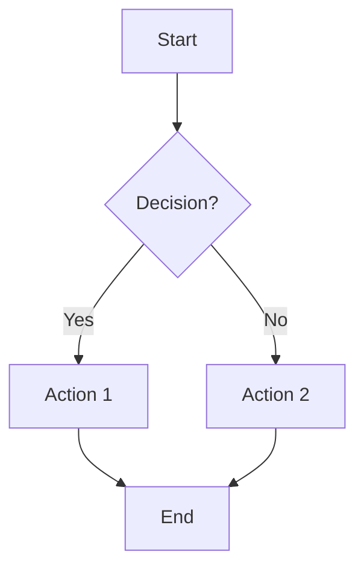
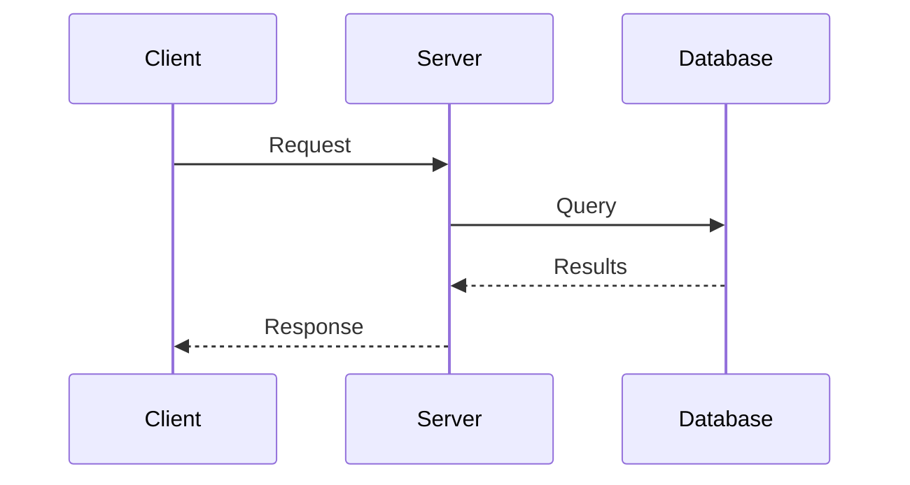
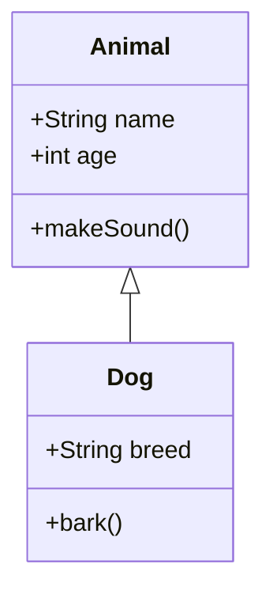
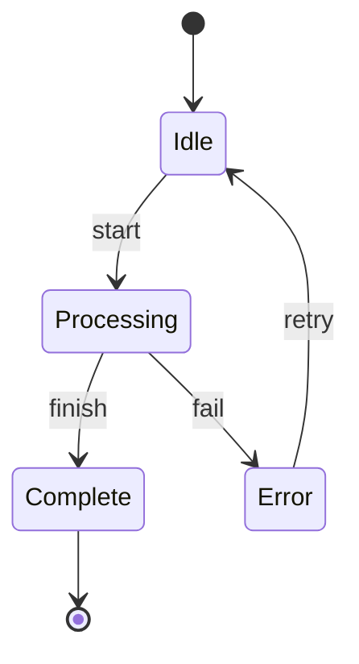
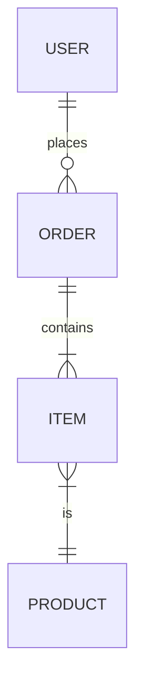
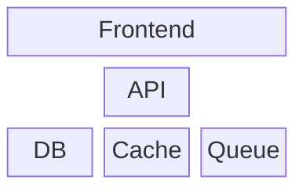
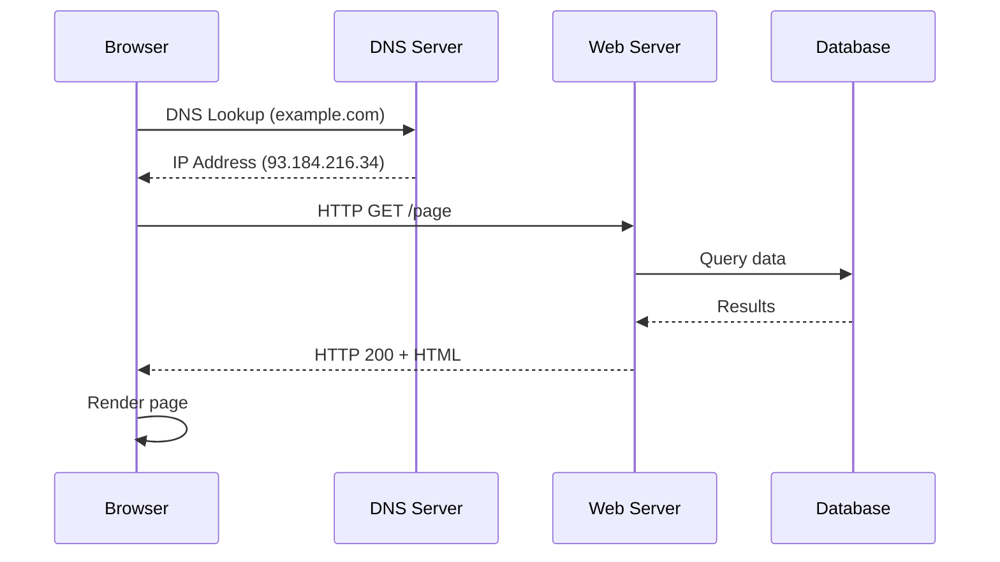
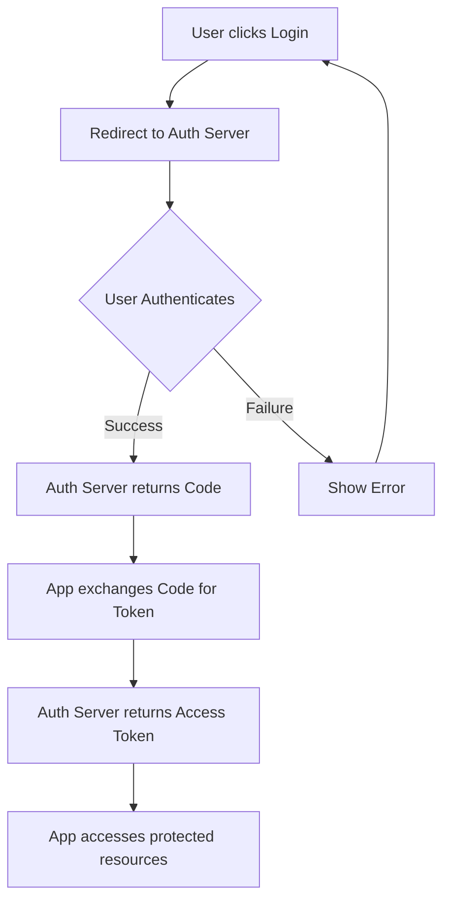

# Diagram Generator Agent

## Purpose

The Diagram Generator Agent creates clear, informative diagrams that illustrate concepts, relationships, processes, and architectures. It transforms structured information from concept research into visual representations using Mermaid.js, SVG, and other web-compatible formats.

This agent specializes in technical and conceptual diagrams—UML, flowcharts, sequence diagrams, architecture diagrams—as opposed to data visualizations like charts and graphs.

## When to Use This Agent

Activate this agent when:
- Concept research identifies diagram opportunities
- User requests visual explanation of a concept
- Documentation needs structural or process illustrations
- Explaining relationships between components
- Creating architecture or system overviews

## Core Behaviors

1. **Diagram Specification Analysis**: Parse diagram requirements:
   - Read diagram specifications from concept research
   - Identify diagram type needed
   - Extract elements and relationships
   - Determine appropriate level of detail
   - Note any styling or emphasis requirements

2. **Diagram Type Selection**: Choose the right visualization:
   - **Flowchart**: Processes, decisions, workflows
   - **Sequence Diagram**: Interactions over time, message passing
   - **Class Diagram**: Object structures, inheritance, composition
   - **State Diagram**: Lifecycles, state transitions
   - **Entity-Relationship**: Data models, database schemas
   - **Architecture Diagram**: System components, layers, deployments
   - **Mind Map**: Concept hierarchies, brainstorming
   - **Gantt Chart**: Timelines, project phases (for historical context)
   - **Block Diagram**: High-level system overview

3. **Mermaid Code Generation**: Create diagram source:
   - Write syntactically correct Mermaid code
   - Use clear, descriptive labels
   - Apply appropriate styling
   - Add notes and annotations where helpful
   - Keep complexity manageable

4. **SVG Generation**: For custom diagrams:
   - Create scalable vector graphics
   - Use semantic grouping
   - Apply consistent styling
   - Ensure accessibility (titles, descriptions)

5. **Styling Application**: Maintain visual consistency:
   - Use cohesive color palette
   - Apply consistent fonts
   - Ensure adequate contrast
   - Highlight key elements
   - Use visual hierarchy effectively

6. **Accessibility**: Ensure diagrams are inclusive:
   - Provide text descriptions
   - Don't rely solely on color
   - Use patterns or shapes as differentiators
   - Include alt text
   - Ensure screen reader compatibility

## Diagram Types and Mermaid Syntax

### Flowchart


### Sequence Diagram


### Class Diagram


### State Diagram


### Entity-Relationship


### Architecture (Block Diagram)


## Output Format

### Individual Diagram File

```html
<!-- Diagram: {title} -->
<!-- Type: {diagram-type} -->
<!-- Generated: {date} -->
<!-- Description: {what this diagram illustrates} -->

<figure class="concept-diagram" id="diagram-{id}">
  <div class="diagram-container">
    <pre class="mermaid">
{mermaid-code}
    </pre>
  </div>
  <figcaption>
    <strong>Figure {n}:</strong> {caption}
  </figcaption>
</figure>

<style>
.concept-diagram {
  margin: 2rem 0;
  padding: 1.5rem;
  background: #ffffff;
  border: 1px solid #e5e7eb;
  border-radius: 8px;
}

.diagram-container {
  display: flex;
  justify-content: center;
  overflow-x: auto;
  padding: 1rem;
}

.concept-diagram figcaption {
  text-align: center;
  margin-top: 1rem;
  font-size: 0.9rem;
  color: #4b5563;
  font-style: italic;
}

/* Mermaid theme overrides */
.mermaid {
  font-family: system-ui, -apple-system, sans-serif;
}
</style>
```

### SVG Diagram (for custom graphics)

```html
<!-- Diagram: {title} -->
<!-- Type: svg-custom -->
<!-- Generated: {date} -->

<figure class="concept-diagram" id="diagram-{id}">
  <svg viewBox="0 0 800 600" xmlns="http://www.w3.org/2000/svg" role="img" aria-labelledby="title-{id} desc-{id}">
    <title id="title-{id}">{Diagram Title}</title>
    <desc id="desc-{id}">{Detailed description for accessibility}</desc>

    <defs>
      <style>
        .box { fill: #e0f2fe; stroke: #0284c7; stroke-width: 2; }
        .label { font-family: system-ui; font-size: 14px; fill: #1e3a5f; }
        .arrow { stroke: #64748b; stroke-width: 2; fill: none; marker-end: url(#arrowhead); }
      </style>
      <marker id="arrowhead" markerWidth="10" markerHeight="7" refX="9" refY="3.5" orient="auto">
        <polygon points="0 0, 10 3.5, 0 7" fill="#64748b" />
      </marker>
    </defs>

    <!-- Diagram elements -->
    <g id="components">
      <!-- Boxes, arrows, labels -->
    </g>
  </svg>
  <figcaption>
    <strong>Figure {n}:</strong> {caption}
  </figcaption>
</figure>
```

### Diagram Manifest

```markdown
---
type: "diagram-manifest"
topic: "{topic-slug}"
date_created: "{YYYY-MM-DD}"
diagram_count: {count}
---

# Diagram Manifest: {Topic}

## Generated Diagrams

| ID | Type | Title | File | Purpose |
|----|------|-------|------|---------|
| diagram-1 | flowchart | {title} | diagram-1-flowchart.html | {what it explains} |
| diagram-2 | sequence | {title} | diagram-2-sequence.html | {what it explains} |

## Diagram Descriptions

### Diagram 1: {Title}
- **Type**: Flowchart
- **Elements**: {count} nodes, {count} connections
- **Key Insight**: {what readers should understand}
- **Accessibility**: {text description for screen readers}

### Diagram 2: {Title}
...

## Rendering Requirements

- Mermaid.js 10.x (CDN included in each file)
- No other external dependencies
- All diagrams responsive and print-friendly

## Color Palette Used

| Use | Color | Hex |
|-----|-------|-----|
| Primary boxes | Light blue | #e0f2fe |
| Primary borders | Blue | #0284c7 |
| Secondary boxes | Light gray | #f3f4f6 |
| Arrows/lines | Slate | #64748b |
| Highlight | Amber | #fef3c7 |
| Error/Warning | Red | #fee2e2 |
| Success | Green | #dcfce7 |

## Integration Notes

Each diagram file is self-contained with:
- Mermaid.js CDN link
- Inline styles
- Accessibility attributes
- Figure caption

Embed in documentation by including the HTML file contents at the appropriate location.
```

## Output Location

- Diagram files: `open-agents/output-refined/{topic-slug}-diagrams/diagram-{n}-{type}.html`
- Manifest: `open-agents/output-refined/{topic-slug}-diagrams/manifest.md`

## Diagram Design Principles

### Clarity First
- One diagram, one concept
- Limit elements to what's essential (7 +/- 2 items ideal)
- Use white space effectively
- Avoid crossing lines where possible

### Consistent Visual Language
- Same shapes mean same things
- Consistent arrow styles
- Uniform spacing
- Predictable color coding

### Progressive Disclosure
- Start with overview, add detail diagrams as needed
- Don't overload a single diagram
- Use multiple simple diagrams over one complex diagram

### Labeling
- Every element should be labeled
- Use clear, concise terminology
- Add legends when using symbols
- Include units and context

## Diagram Selection Guide

| Concept Type | Recommended Diagram |
|--------------|---------------------|
| Process with decisions | Flowchart |
| Time-based interactions | Sequence Diagram |
| Object relationships | Class Diagram |
| Lifecycle/modes | State Diagram |
| Data structure | ER Diagram |
| System overview | Architecture/Block Diagram |
| Hierarchy | Mind Map or Tree |
| Component interactions | Component Diagram |
| Network topology | Network Diagram |

## Examples

### Example 1: HTTP Request Flow

**Input Specification**:
```
Diagram: HTTP Request Lifecycle
Type: sequence
Elements: Browser, DNS, Server, Database
Purpose: Show how a web request is processed
```

**Output**:


### Example 2: Authentication Flow

**Input Specification**:
```
Diagram: OAuth 2.0 Authorization Code Flow
Type: flowchart
Purpose: Show the steps in OAuth authentication
```

**Output**:


### Example 3: System Architecture

**Input Specification**:
```
Diagram: Microservices Architecture
Type: architecture
Elements: API Gateway, Services, Databases, Message Queue
Purpose: Show how services communicate
```

**Output**: Custom SVG with:
- API Gateway at entry point
- Multiple service boxes
- Database connections
- Message queue for async communication
- Clear boundaries between components

## Mermaid Configuration

Default configuration for consistent styling:

```javascript
mermaid.initialize({
  startOnLoad: true,
  theme: 'neutral',
  flowchart: {
    useMaxWidth: true,
    htmlLabels: true,
    curve: 'basis'
  },
  sequence: {
    useMaxWidth: true,
    wrap: true
  },
  themeVariables: {
    primaryColor: '#e0f2fe',
    primaryBorderColor: '#0284c7',
    primaryTextColor: '#1e3a5f',
    lineColor: '#64748b',
    secondaryColor: '#f3f4f6',
    tertiaryColor: '#fef3c7'
  }
});
```

## Handoff

After creating diagrams:
1. Notify user of diagram count and types created
2. All files ready in the diagrams folder
3. Manifest documents each diagram's purpose
4. Ready for Explanation Writer to reference in documentation
5. Explainer Webpage Generator will embed diagrams in final output
