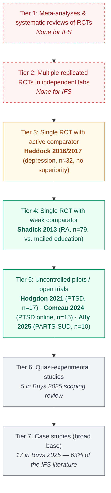
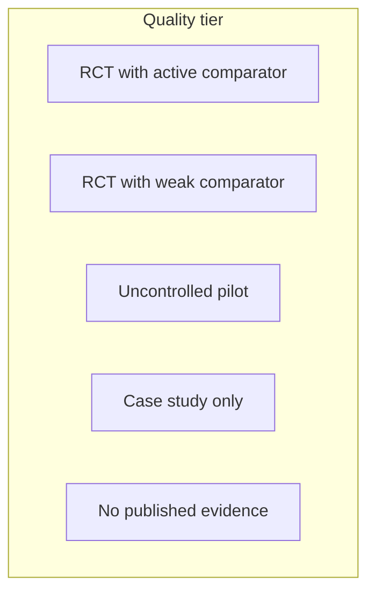
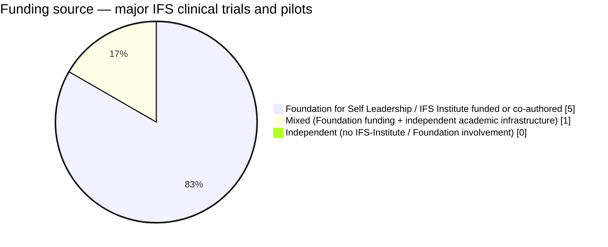
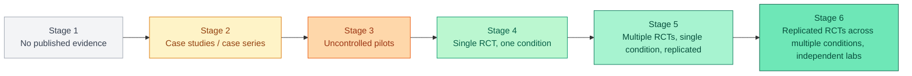

# Diagrams: IFS Evidence Base

These diagrams visualize the strength-of-evidence picture for IFS as of April 2026. They are designed to give a calibrated reader an at-a-glance map of where the evidence is solid, where it's preliminary, and where it's effectively absent.

---

## Diagram 1: Evidence Pyramid — IFS Studies Plotted by Tier

**Type**: Layered pyramid (Mermaid flowchart)
**Purpose**: Show the strength-of-evidence hierarchy and where each IFS study sits, including the visibly empty top tiers.

**Reading this diagram**: The pyramid is upside-down compared to where IFS marketing places it. The narrow top tiers (where reliable inference lives) are empty. The wide base (where IFS has substantial volume) is mostly case studies. The gap between adoption and evidence quality is what this picture is for.

---

## Diagram 2: Conditions Studied vs. Quality of Evidence — Matrix

**Type**: Matrix grid (HTML table for the webpage; described here as a structured layout)
**Purpose**: At a glance, which conditions have what quality of evidence.

| Condition | RCT (active comparator) | RCT (weak comparator) | Uncontrolled pilot | Case study only | None |
|-----------|------------------------|----------------------|--------------------|-----------------|------|
| Rheumatoid arthritis | — | **Shadick 2013 (n=79)** | — | — | — |
| Depression | **Haddock 2016/2017 (n≈32)** — no significant difference | — | — | — | — |
| PTSD | — | — | **Hodgdon 2021 (n=17)** · **Comeau 2024 (n=15)** | — | — |
| PTSD + Substance use | — | — | **Ally 2025 PARTS-SUD (n=10)** | — | — |
| Anxiety | — | — | — | Secondary outcome only | — |
| Eating disorders (origin condition) | — | — | — | Sparse | Mostly absent |
| Dissociative disorders | — | — | — | Sparse | Mostly absent |
| Chronic pain (non-RA) | — | — | — | Yes | — |
| Autism / alexithymia | — | — | — | — | **None** |
| Neurodivergent populations | — | — | — | — | **None** |
| OCD / anxiety disorders | — | — | — | — | **None** |
| Bipolar / serious mental illness | — | — | — | — | **None** |

**Reading this matrix**: Empty cells are the message. The strongest evidence is in rheumatoid arthritis — a chronic-illness adjunct, not a stand-alone trauma intervention. The most-marketed evidence (PTSD) lives in the "uncontrolled pilot" column. Eating disorders is striking: 40+ years after IFS was developed with bulimic patients, there is no eating-disorder RCT.

---

## Diagram 3: Funding-Source Breakdown — IFS-Foundation-Funded vs. Independent

**Type**: Annotated pie chart description (rendered in webpage with SVG or a styled HTML pie)
**Purpose**: Show how concentrated the IFS evidence base's funding pipeline is.

**Studies counted**:
- Shadick 2013 RA RCT — Schwartz co-author, Sweezy author; Brigham & Women's / Harvard infrastructure (mixed)
- Haddock 2016/2017 depression RCT — Foundation-supported per Foundation press materials
- Hodgdon 2021 PTSD pilot — Foundation for Self Leadership funded
- Comeau 2024 PARTS PTSD pilot — Foundation funded
- Ally 2025 PARTS-SUD pilot — Schwartz Research Fellowship + Foundation funded
- Buys 2025 scoping review — independent academic (literature synthesis, not new data)

**Reading this chart**: As of April 2026, every IFS clinical trial and pilot in the published peer-reviewed literature is either funded by the Foundation for Self Leadership / IFS Institute or has authorship that includes the IFS founder or senior IFS-Institute figures. This is a pattern, not a verdict — but it is the reason "independent replication" is the most-needed missing piece.

**Caveat**: The Foundation publicly states it operates at arm's length, with independent review processes. This is the standard mitigation. It is not the same as evidence produced by funders with no stake in the outcome.

---

## Diagram 4: What "Evidence-Based" Means — Threshold Spectrum

**Type**: Horizontal spectrum diagram (Mermaid flowchart LR with custom labels)
**Purpose**: Make the minimal-threshold vs. strong-threshold distinction visible, and place IFS on the spectrum next to credible comparators.

**Where IFS sits, by condition**:
- **IFS for rheumatoid arthritis**: Stage 4 — single RCT (Shadick 2013), proof-of-concept, weak comparator
- **IFS for depression**: between Stage 3 and Stage 4 — single underpowered pilot RCT (Haddock 2016/2017)
- **IFS for PTSD**: Stage 3 — uncontrolled pilots only (Hodgdon 2021, Comeau 2024)
- **IFS for PTSD + substance use**: Stage 3 — single-arm pilot (Ally 2025)
- **IFS for anxiety, eating disorders, autism, alexithymia**: Stage 1 or Stage 2

**Where comparator therapies sit**:
- **CBT for depression**: Stage 6 — hundreds of RCTs, multiple meta-analyses, replicated superiority over waitlist and equivalence with active comparators
- **EMDR for PTSD**: Stage 6 — multiple RCTs, APA / WHO endorsement, comparable effects to PE/CPT
- **Prolonged Exposure (PE) for PTSD**: Stage 6
- **Cognitive Processing Therapy (CPT) for PTSD**: Stage 6

**Reading this spectrum**: When marketing copy says "IFS is evidence-based," it generally means Stage 4 for one specific condition (rheumatoid arthritis). It does NOT mean Stage 5 or 6 for any condition. The most-needed work is independent replication of the existing RCT/pilot signals — moving IFS from "single-RCT" to "replicated-RCT" status.

---

## Notes for the Webpage Generator

- Diagram 1 (pyramid) renders cleanly in Mermaid TD with the empty/thin/present color classes.
- Diagram 2 (matrix) should render as a styled HTML table with color-coded cells; the Mermaid block above is a legend only.
- Diagram 3 (pie) — Mermaid's `pie showData` works; alternatively use Chart.js for interactivity.
- Diagram 4 (spectrum) renders in Mermaid LR; the comparator placements should be in an annotation box adjacent to the diagram.
- All diagrams should be accessible — include text descriptions for screen readers and don't rely solely on color to communicate meaning.
- Color palette aligns with the deep dive's existing scheme (primary indigo `#6366F1`, success green `#10B981`, warning amber `#F59E0B`).
