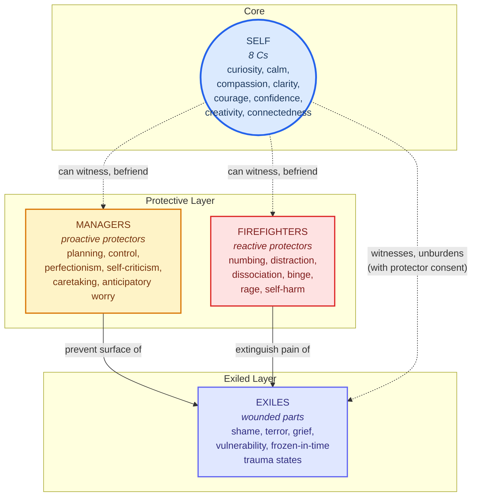

# Diagram 1: Parts Taxonomy — Self at Center, Protectors Outward, Exiles Behind

**Type**: Mermaid flowchart (radial-ish layout)
**Purpose**: One-glance overview of the four-component IFS model. Shows Self as the core, the two protector classes (Managers as proactive, Firefighters as reactive) as outer layers, and Exiles as the wounded inner parts the protectors are organized around.

**Caption**: The IFS parts taxonomy. The Self sits at the core, embodying the 8 C qualities. Two protector classes ring it: Managers (proactive — try to prevent the wound from being re-triggered) and Firefighters (reactive — try to extinguish pain after it surfaces). Both protect the same Exiles — wounded parts carrying the unprocessed pain (burden) of past overwhelm. Solid arrows show the protective relationships that *block* the exile from awareness; dashed arrows show what becomes available when Self engages with the system. The diagram shows the model's claim that Self is structurally distinct from parts — not a part among parts, but the seat from which parts can be related to.
