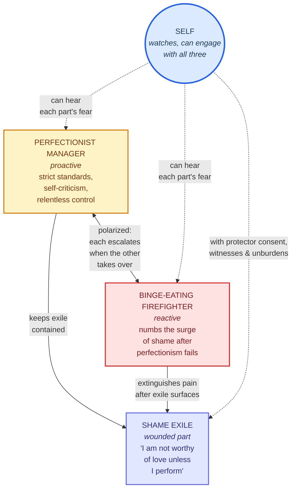

# Diagram 2: Polarization — Manager–Firefighter Pair Around an Exile

**Type**: Mermaid flowchart
**Purpose**: Show the classic polarized-protector dynamic with a concrete worked example: a Perfectionist Manager and a Binge-eating Firefighter both protecting a Shame Exile, escalating in response to each other.

**Caption**: A classic polarized-protector pair. Both the perfectionist Manager and the binge-eating Firefighter protect the same Shame Exile, with the same goal (keep "I am not worthy" out of awareness) but opposite tactics. When the Manager's strict control fails, the exile's pain surfaces and the Firefighter activates to numb it. The Manager then doubles down with shame and stricter control, which sets up the next failure, which sets up the next binge. The cycle is self-reinforcing — neither protector can be "fixed" alone because each one's extreme behavior is part of why the other one is doing what it is doing. The IFS clinical move (shown by dashed arrows from Self) is not to side with one against the other but to bring Self into relationship with both, hear each one's fear, and eventually access the exile underneath.
